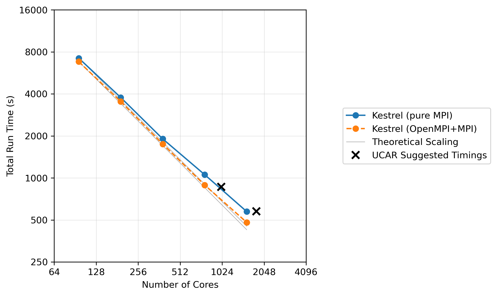

# WRF Benchmarking

Weather Research and Forecasting (WRF) benchmarking and building instructions. This document is organized as follows:

1. [Step 1: Building WRF](#step-1-building-wrf): This describes the process required to build the WRF executable from source code.
2. [Step 2: Submitting Benchmarking Jobs](#step-2-submitting-benchmarking-jobs): This described how to access the benchmarking job and modify it to test our WRF installation.
3. [Step 3: Measuring and Recording Performance](#step-3-measuring-and-recording-performance): This section defines what metrics will be recorded and how to calculate them.
4. [Run Definitions and Requirements](#run-definitions-and-requirements): We outline what results to include in the response and give examples for comparison.

---

## Step 1: Building WRF

> [!NOTE]  
> The steps described in this section (particularly Step 1.3 and the `PNETCDF` and `HDF5` environment variables in Step 1.4) are specific to building WRF on the Kestrel HPC and current for December 2025. It is expected that minor modifications *will be required* on other systems and/or as the WRF dependencies are updated/available. Using modified versions of these supporting modules and setting the required environment variables appropriately is both acceptable and expected within the context of a "Baseline (as-is)" benchmark.

### 1.0. Request an Interactive Node
Before starting the build process, you may wish to request an interactive node to parallelize the compilation process, significantly reducing build time. If you don't have access to such resources, proceed immediately to Step 1.1. As a guideline, the entire workflow described in these instructions can be completed within approximately 15 minutes, so requesting a 60-minute session is a safe estimate. Replace `<allocation_name>` with your appropriate allocation name to initiate the session. As an example:

```bash
salloc -A <allocation_name> -t 60
```

### 1.1: Download WRF and WPS Source Code
Start by downloading the source code for the WRF model and its companion, the WRF Preprocessing System (WPS). Use the provided links to download the specific versions of WRF (v4.7.1) and WPS (v4.6.0). The commands below will fetch compressed `.tar.gz` archives from the official WRF GitHub repository.

```bash
wget https://github.com/wrf-model/WRF/releases/download/v4.7.1/v4.7.1.tar.gz
wget https://github.com/wrf-model/WPS/archive/refs/tags/v4.6.0.tar.gz
```

### 1.2: Extract the Source Code
Once you've downloaded the archives, unpack them to access the source code. The `tar` command extracts the contents of the `.tar.gz` files and creates directories corresponding to the source files. This step produces directories containing WRF (WRFV4.7.1) and WPS (WPS-4.6.0).

```bash
tar -xvzf v4.6.0.tar.gz 
tar -xvzf v4.7.1.tar.gz 
```

### 1.3: Load Necessary Modules
The next step is loading the required software modules. By purging existing modules and loading specific versions of compilers and libraries, you ensure a clean environment and avoid compatibility issues during compilation. The commands below load GNU compilers (`PrgEnv-gnu/8.5.0`), NetCDF libraries (which automatically loads pnetcdf libraries and hdf5 libraries on the reference system) (`netcdf/4.9.3-cray-mpich-gcc`), and Jasper libraries (`jasper/1.900.1-cray-mpich-gcc`) that support WRF.

```bash
module purge
module load PrgEnv-gnu/8.5.0 
module load netcdf/4.9.3-cray-mpich-gcc
module load jasper/1.900.1-cray-mpich-gcc
```

### 1.4: Set Environment Variables
Define environment variables to facilitate the compilation process. These variables specify file paths, library locations, and directory structures required by the build system. Update the paths of `WRF_DIR` and `WPS_DIR` in the example to match your local installation setup. 

```bash
export PATH="/usr/bin:${PATH}"
export LD_LIBRARY_PATH="/usr/lib64:${LD_LIBRARY_PATH}"

export WRF_DIR=/scratch/<user>/<benchmark_folder>/WRFV4.7.1/
export WPS_DIR=/scratch/<user>/<benchmark_folder>/WPS-4.6.0/

export PNETCDF=$PNETCDF_DIR 
export HDF5=$HDF5_DIR
```

### 1.5: Configure WRF Build Options
Navigate to the WRF directory specified earlier using the `WRF_DIR` variable. Run the `configure` script, which will ask you to specify build options. At the first prompt, select option `35` for `(dm+sm) GNU (gfortran/gcc)` which compiles WRF with support for shared memory (SM) and distributed memory (DM) parallelism. At the second prompt, specify the type of nesting desired by selecting option `1=basic`. Nesting allows for finer resolution within a defined area.

```bash
cd ${WRF_DIR}
./configure
```

First prompt:
```bash
Enter selection [1-83] : 35
```

Second prompt:
```bash
Compile for nesting? (1=basic, 2=preset moves, 3=vortex following) [default 1]:1
```

### 1.6: Compile WRF
Compile WRF with parallel processing to reduce build time. The `-j` flag specifies the number of cores to use during compilation; select up to 20 cores (you may use fewer if resources are limited). Upon successful compilation, you should see a summary of executables created in the `main` directory (e.g., `wrf.exe`, `real.exe`).

```bash
./compile -j 16 em_real
```

where the summary of executables upon compilation should look similar to:

```bash
build started:   Wed Nov 12 15:14:18 MST 2025
build completed: Wed Nov 12 15:17:30 MST 2025
 >                  Executables successfully built                  
 
-rwxrwxr-x 1 <user> <user> 39826880 Nov 12 15:17 main/ndown.exe
-rwxrwxr-x 1 <user> <user> 36185816 Nov 12 15:17 main/real.exe
-rwxrwxr-x 1 <user> <user> 35632920 Nov 12 15:17 main/tc.exe
-rwxrwxr-x 1 <user> <user> 45807024 Nov 12 15:17 main/wrf.exe
```

### 1.7: Configure WPS Build Options
Move to the WPS directory specified in the `WPS_DIR` variable. Similar to the WRF configuration, we begin by running the `configure` script first. Select option `3` at the prompt, which is suitable for `Linux x86_64, gfortran (dmpar)` setups. This configuration prepares WPS for parallel processing.

```bash
cd ${WPS_DIR}
./configure
```

First prompt:
```bash
Enter selection [1-44] : 3
```

### 1.8: Modify and Save WPS Configuration
After running the `configure` script, locate the file `configure.wps` in the WPS directory. Open this file using a text editor and search for the `WRF_LIB` variable on line 44. Modify the last line of this assignment to include the `-fopenmp` flag as shown below, which enables OpenMP support during compilation. This step ensures compatibility between WRF and WPS.

```bash
WRF_LIB         =       -L$(WRF_DIR)/external/io_grib1 -lio_grib1 \
                        -L$(WRF_DIR)/external/io_grib_share -lio_grib_share \
                        -L$(WRF_DIR)/external/io_int -lwrfio_int \
                        -L$(WRF_DIR)/external/io_netcdf -lwrfio_nf \
                        -L$(NETCDF)/lib -lnetcdff -lnetcdf -fopenmp
```

Save the file and exit the editor.

### 1.9: Compile WPS
Run the WPS compile process to generate the necessary executables. If successful, the `compile` script will create the executables `geogrid.exe`, `ungrib.exe`, and `metgrid.exe`.

```bash
./compile
```

---

## Step 2: Submitting Benchmarking Jobs

### 2.1: Create Copies of Run Directories 
Create multiple versions of the run directory to accommodate different benchmarking cases. For example, suffix `mpi-02` and `mpi-04` denote pure MPI runs on 2 nodes and 4 nodes respectively. Naming these directories helps distinguish settings and save independent results for different benchmarking scenarios.

```bash
cp -r ${WRF_DIR}/run/ ${WRF_DIR}/conus2.5km-mpi-02
cp -r ${WRF_DIR}/run/ ${WRF_DIR}/conus2.5km-mpi-04
...
```

### 2.2: Download and Extract Benchmark Data
Download the 2.5-km CONUS benchmark dataset (~34GB). These files include the inputs, supporting scripts, and truth values required to perform the benchmarking. Unpack the files after download to expose the necessary files for your test cases.

```bash
wget https://www2.mmm.ucar.edu/wrf/users/benchmark/v44/v4.4_bench_conus2.5km.tar.gz
tar -xvzf v4.4_bench_conus2.5km.tar.gz
cd v4.4_bench_conus2.5km
```

### 2.3: Modify Benchmark File for Parallel NetCDF
We will make a slight modification to the provided `namelist.input` file to utilize the parallel netcdf functionality we compiled the WRF executable with. From within the `v4.4_bench_conus2.5km` directory, open the `namelist.input` file for writing in an editor of your choice. Modify the input file on lines 24 and 25 to use a parallel writing strategy by changing the value of the `io_form_history` and `io_form_restart` variables from `2` to `11` as shown below.

```bash
io_form_history                     = 11,
io_form_restart                     = 11,
```

Save and close the file once changes are applied.

### 2.4: Copy Benchmark Files to Run Directories
Copy all required input files from the benchmark directory to each of the created run directories (`conus2.5km-mpi-02`, `conus2.5km-mpi-04`, etc.). This step ensures the WRF executable in each directory has access to the correct data inputs.

```bash
cp *.dat *.input *_d01 ${WRF_DIR}/conus2.5km-mpi-02
cp *.dat *.input *_d01 ${WRF_DIR}/conus2.5km-mpi-04
...
```

### 2.5: Create Job Submission Script
Within each run directory, create a submission script named `submit_job.sbatch`. This script provides the configuration needed to run WRF using Slurm. Below is the example for a 2-node, pure-MPI case (i.e., one thread per MPI task, `OMP_NUM_THREADS=1`), which utilizes 92% of the cores on each node. You can update the `--nodes`, `num_cores`, and `OMP_NUM_THREADS` values for additional configurations as described in [Run Definitions and Requirements](#run-definitions-and-requirements). Save the file to the respective run directory, e.g., `${WRF_DIR}/conus2.5km-mpi-02/submit_job.sbatch`.

```bash
#!/bin/bash
#SBATCH --account=hpcapps
#SBATCH --time=4:00:00
#SBATCH --nodes=2
#SBATCH --exclusive
#SBATCH --mem=0

module purge
module load PrgEnv-gnu/8.5.0
module load netcdf/4.9.3-cray-mpich-gcc
module load jasper/1.900.1-cray-mpich-gcc

export OMP_NUM_THREADS=1

srun -n 192 --cpu-bind=rank_ldom ./wrf.exe
```

### 2.6: Submit the Benchmark Job
Submit the job using Slurm with the `sbatch` command.

```bash
sbatch submit_job.sbatch
```

---

## Step 3: Measuring and Recording Performance

Once benchmarking jobs finish successfully, the configured run directories will contain outputs and diagnostic files. Use these files to measure and analyze performance metrics for each test case.

### 3.1: Run the Timing Script

For each of the run directories created above, we will examine the timings reported in the `rsl.error.0000` file. This human-readable file contains lots of valuable information, but we will focus primarily on the execution time. A parsing script, [`get_timing.py`](get_timing.py), is supplied here and can be executed like:

```bash
python get_timing.py --rsl_file=${WRF_DIR}/conus2.5km-mpi-02/rsl.error.0000 --rsl_file=${WRF_DIR}/conus2.5km-mpi-04/rsl.error.0000
```

This script combs through the rsl.error.0000 file(s) specified with the `--rsl_file` flag and extracts the timing results per each step of the algorithm, delineating the steps where file writing was performed since this adds an appreciable amount of time. Note that the `tabulate` package is required to run this script. If it is not already installed in your Python environment, simply do `pip install tabulate`.

---

## Run Definitions and Requirements


Benchmarking WRF requires reporting these timing results from two sets of runs each comprised of 5 test cases for a total of 10 runs. The first set of runs uses pure MPI parallelism (i.e., one OpenMP thread per MPI task) and tests strong scaling performance across 1, 2, 4, 8, and 16 nodes. The Offeror may adjust the total number of MPI tasks, but note that in each case, *at least 80% of the available cores per every node must be utilized.* The second set of runs uses hybrid OpenMP + MPI parallelism (i.e., 4 threads per MPI task) and tests strong scaling performance across the same 1, 2, 4, 8, and 16 node jobs. Note that since each MPI task uses 4 threads, the requirement for the total number of MPI tasks per every node is reduced to 20%.

For these required cases, report the number of MPI tasks, number of threads, number of iterations during the calculation, total write time, and total time in the reporting spreadsheet (the `get_timing.py` script provides all these outputs). Optionally, the Offeror may include a set of additional "Optimized" cases that use different OpenMP:MPI ratios, node saturations, `namelist.input` specifications, building instructions, etc., provided any details and/or instructions necessary to reproduce these results are provided as explained in the [definition of "Optimized"](../README.md#draft-definitions-for-baselineas-is-ported-and-optimized-runs).

For clarity and comparison, we include the summarized results of carrying out the required benchmarks on the Kestrel HPC below. The output of running the `get_timing.py` script on the 5 `rsl.error.0000` files for the pure MPI tests is:

```
  MPI Tasks    Threads    Iterations    Write Time (s)    Total Time (s)
-----------  ---------  ------------  ----------------  ----------------
         96          1          1440              71.0            7210.9
        192          1          1440              87.4            3768.1
        384          1          1440              64.7            1903.9
        768          1          1440              84.1            1054.7
       1536          1          1440              85.2             574.1
```

The output of running the `get_timing.py` script on the 5 `rsl.error.0000` files for the hybrid OpenMP + MPI tests is:

```
  MPI Tasks    Threads    Iterations    Write Time (s)    Total Time (s)
-----------  ---------  ------------  ----------------  ----------------
         24          4          1440              49.9            6809.0
         48          4          1440              53.6            3526.0
         96          4          1440              38.7            1747.9
        192          4          1440              40.9             888.3
        384          4          1440              46.5             480.4
```

Additionally, the 10x `rsl.error.0000` files necessary to produce these tables are [included here](conus_2.5km/example_outputs/). Visualizing these outputs provides a clearer picture of reasonable scaling performance up to 16 nodes.


*The results for the two sets of required benchmarks obtained on the Kestrel HPC. The plotted values correspond to the "Total Time" columns in the tables above*
